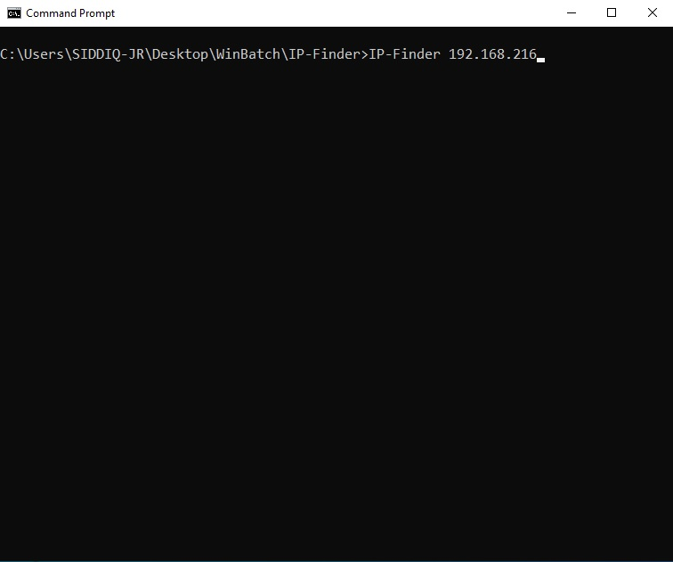
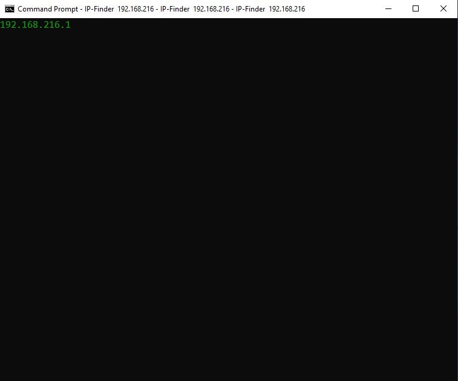
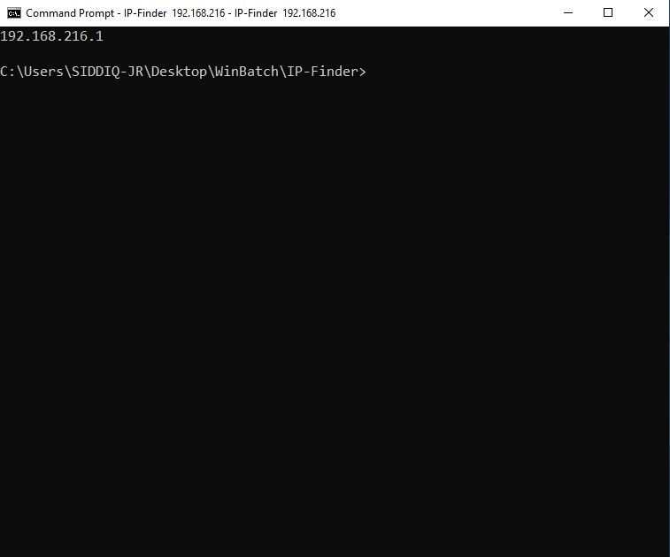
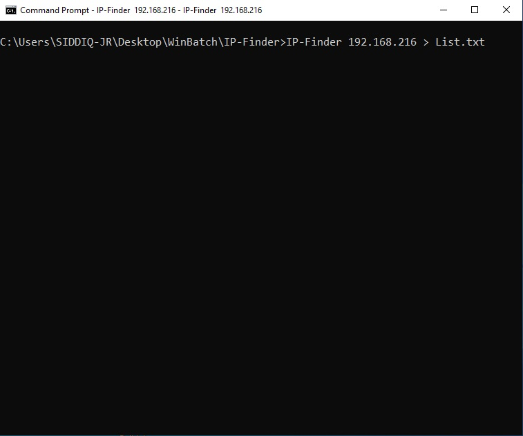
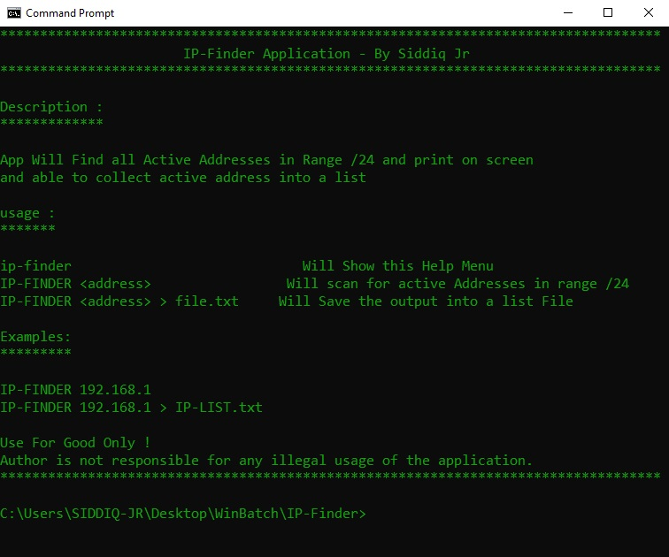
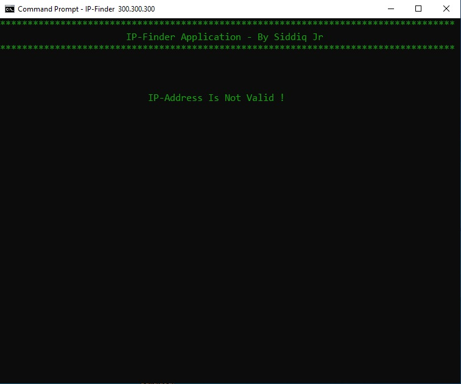

Description:

IP-Finder is a Windows Biased IP address scanning tool uses the ping function to detect if an address is active or not.

Operation:

The Tool gets an ip address for the range /24 but without filling the final part, for example : 192.168.43 and the app will check foe validity of all three parts if there are with in (0 - 256) range , then creates a list for all valid addresses to ping and finally print the active addresses by getting the result from the ping function.

Installation:

It's a batch script So there is no actual installation, But To work Correctly please review the requirements.

Requirements:

  * Windows Operation System, Preferably (Win10/Win11).
  * All Environmental variables are set as defaults, "PATH" Environmental
    variable
    Could have more than one value.

Usage:
    First: 
       open the command prompt, and type 'ip-finder' followed by the address for example : " ip-finder 192.168.43 " and press enter.

    Second: 
        Help and Syntax, if the application runs without  any address it will go automatically to the help menu, and if the ip address is not valid it will tell you that and also go to the help menu.

    Screen Shots :

      
    
    Here the Command prompt is opened and the application options are set correctly to " ip-finder 192.168.43 ".

    Here the application is finding the active addresses.

    Here the application is finished scanning and stopped working, and yes i have only one active address haha lOl.

    Here the user command to save the result to a text file called "list", and it will blink the cursor until it's finished, and won't print anything.

    This is the help menu of the application.

    This screen will show only if there is an invalid ip address is used.

                      That's It you're good to Go,  Enjoy!

Follow Me to Get an Official Release and For the Next Version of This and Other Scripts.

ON YouTube Find a Usage Tutorial and Build Tutorial for This Tool and Others.

YouTube:
https://www.youtube.com/channel/UCS99vn-SuSWUYmVorppAKfg

GitHub:
https://github.com/siddiq-jr/